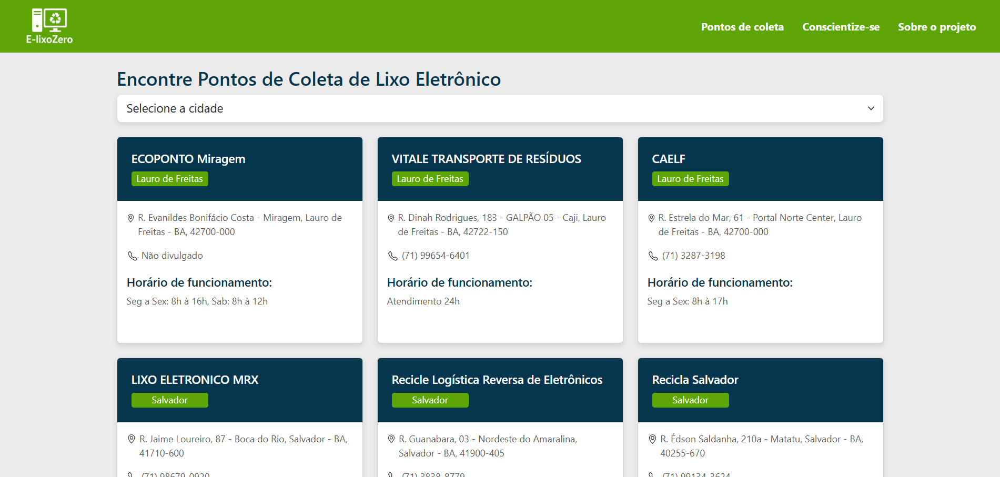
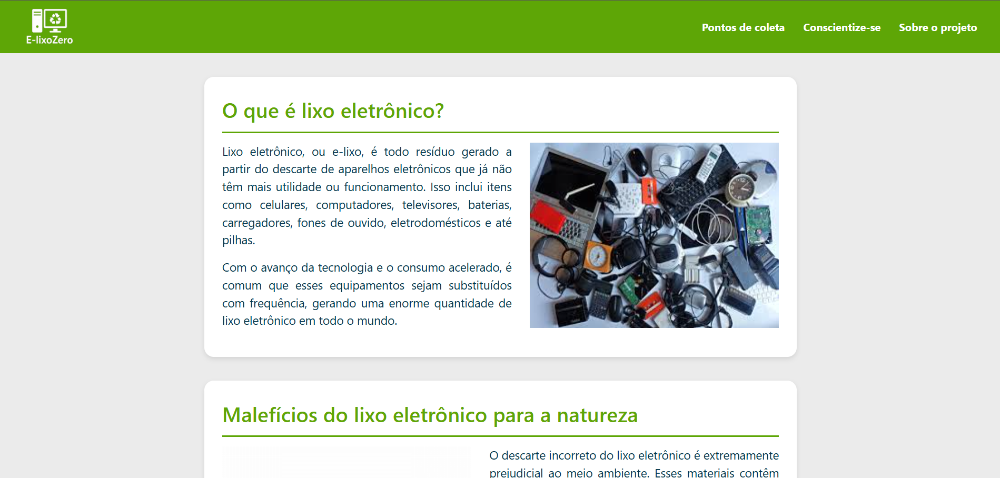
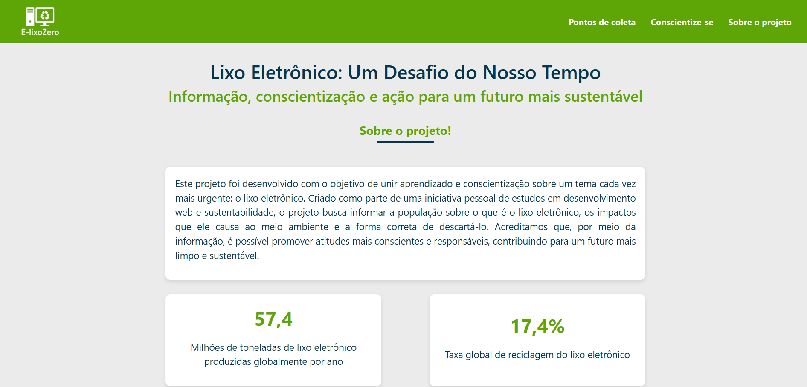

# ♻️ E-lixoZero - Locais para Descarte de Lixo Eletrônico

Este projeto tem como objetivo principal **informar e localizar pontos de coleta de lixo eletrônico** em **Salvador e região metropolitana**. Através de uma interface simples e acessível, os usuários poderão visualizar locais confiáveis para o descarte correto de resíduos eletrônicos.

## 🚧 Status do Projeto

> 🛠️ Finalizado.

---

## 🧰 Tecnologias Utilizadas

- [Vue.js](https://vuejs.org/) - Framework JavaScript para construção da interface
- [Bootstrap](https://getbootstrap.com/) - Estilização rápida e responsiva
- HTML5
- CSS3

---

## 📌 Funcionalidades Planejadas

- Listagem de pontos de coleta com nome, endereço e horário de funcionamento
- Filtros por cidade (Salvador, Lauro de Freitas...)
- Interface adaptável para dispositivos móveis

---

## 📸 Preview

### Página de localizações

### Página de conscientização sobre lixo eletrônico

### Página de informações sobre o projeto

